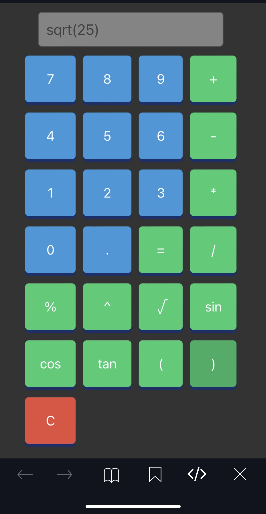

```markdown
# Kalcular - Calculatrice Interactive

## Description

Kalcular est une calculatrice interactive en ligne qui prend en charge diverses opérations, y compris la racine carrée, les fonctions trigonométriques et plus encore. Elle a été développée en HTML, CSS et JavaScript.

## Fonctionnalités

- Opérations de base : Addition, Soustraction, Multiplication, Division
- Opérations avancées : Racine carrée, Exposant, Fonctions trigonométriques
- Interface utilisateur conviviale
- Affichage en temps réel des résultats

## Utilisation

1. Cloner le projet
   ```bash
   git clone https://github.com/Wharkly47/Kalcular.git
   ```

2. Ouvrir le fichier `index.html` dans un navigateur web.

3. Utiliser les boutons de la calculatrice pour effectuer des calculs interactifs.

## Aperçu



## Contribuer

Les contributions sont les bienvenues! Si vous souhaitez contribuer à ce projet, veuillez suivre ces étapes :

1. Fork le projet.
2. Créer une branche pour votre fonctionnalité (`git checkout -b fonctionnalite/ma-fonctionnalite`).
3. Commit vos changements (`git commit -m 'Ajouter une nouvelle fonctionnalité'`).
4. Push vers la branche (`git push origin fonctionnalite/ma-fonctionnalite`).
5. Créer une nouvelle Pull Request.

## Licence

Ce projet est sous licence MIT - voir le fichier [LICENSE](LICENSE) pour plus de détails.
```
